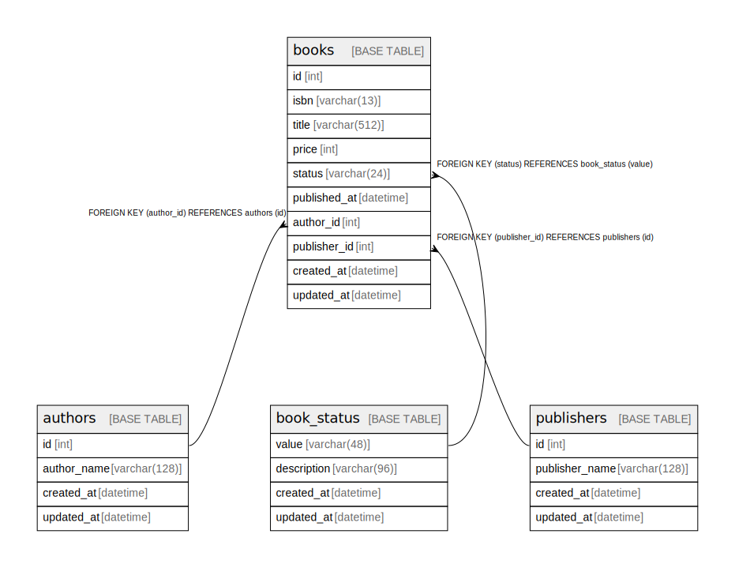

# app

## Tables

| Name | Columns | Comment | Type |
| ---- | ------- | ------- | ---- |
| [authors](authors.md) | 4 | 著者の情報を格納するテーブル | BASE TABLE |
| [book_status](book_status.md) | 4 | 書籍のステータスマスタを格納するテーブル | BASE TABLE |
| [books](books.md) | 10 | 書籍の基本情報を格納するテーブル | BASE TABLE |
| [publishers](publishers.md) | 4 | 出版社の情報を格納するテーブル | BASE TABLE |

## Relations

---

> Generated by [tbls](https://github.com/k1LoW/tbls)
