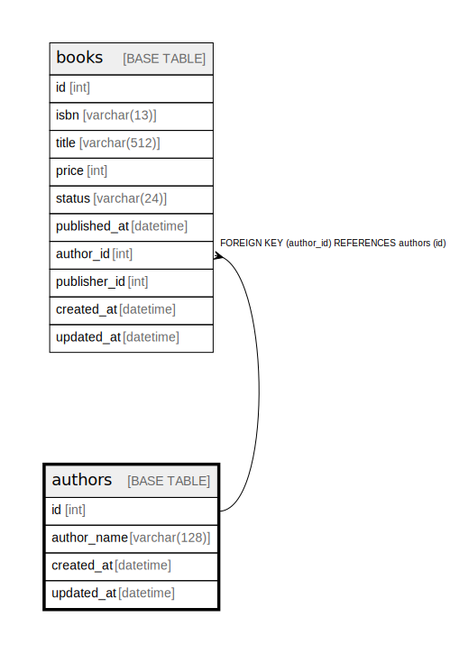

# authors

## Description

著者の情報を格納するテーブル

<details>
<summary><strong>Table Definition</strong></summary>

```sql
CREATE TABLE `authors` (
  `id` int NOT NULL AUTO_INCREMENT COMMENT '著者ID（自動採番）',
  `author_name` varchar(128) COLLATE utf8mb4_unicode_ci NOT NULL COMMENT '著者名',
  `created_at` datetime NOT NULL DEFAULT CURRENT_TIMESTAMP COMMENT 'レコード作成時刻',
  `updated_at` datetime DEFAULT NULL ON UPDATE CURRENT_TIMESTAMP COMMENT 'レコード更新時刻',
  PRIMARY KEY (`id`)
) ENGINE=InnoDB AUTO_INCREMENT=[Redacted by tbls] DEFAULT CHARSET=utf8mb4 COLLATE=utf8mb4_unicode_ci COMMENT='著者の情報を格納するテーブル'
```

</details>

## Columns

| Name | Type | Default | Nullable | Extra Definition | Children | Parents | Comment |
| ---- | ---- | ------- | -------- | ---------------- | -------- | ------- | ------- |
| id | int |  | false | auto_increment | [books](books.md) |  | 著者ID（自動採番） |
| author_name | varchar(128) |  | false |  |  |  | 著者名 |
| created_at | datetime | CURRENT_TIMESTAMP | false | DEFAULT_GENERATED |  |  | レコード作成時刻 |
| updated_at | datetime |  | true | on update CURRENT_TIMESTAMP |  |  | レコード更新時刻 |

## Constraints

| Name | Type | Definition |
| ---- | ---- | ---------- |
| PRIMARY | PRIMARY KEY | PRIMARY KEY (id) |

## Indexes

| Name | Definition |
| ---- | ---------- |
| PRIMARY | PRIMARY KEY (id) USING BTREE |

## Relations



---

> Generated by [tbls](https://github.com/k1LoW/tbls)
