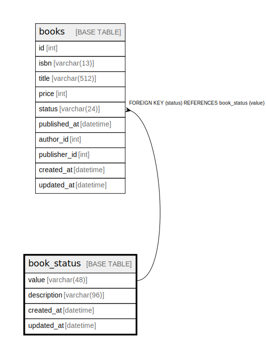

# book_status

## Description

書籍のステータスマスタを格納するテーブル

<details>
<summary><strong>Table Definition</strong></summary>

```sql
CREATE TABLE `book_status` (
  `value` varchar(48) COLLATE utf8mb4_unicode_ci NOT NULL COMMENT '書籍ステータスの値',
  `description` varchar(96) COLLATE utf8mb4_unicode_ci NOT NULL COMMENT '書籍ステータスの説明',
  `created_at` datetime NOT NULL DEFAULT CURRENT_TIMESTAMP COMMENT 'レコード作成時刻',
  `updated_at` datetime DEFAULT NULL ON UPDATE CURRENT_TIMESTAMP COMMENT 'レコード更新時刻',
  PRIMARY KEY (`value`)
) ENGINE=InnoDB DEFAULT CHARSET=utf8mb4 COLLATE=utf8mb4_unicode_ci COMMENT='書籍のステータスマスタを格納するテーブル'
```

</details>

## Columns

| Name | Type | Default | Nullable | Extra Definition | Children | Parents | Comment |
| ---- | ---- | ------- | -------- | ---------------- | -------- | ------- | ------- |
| value | varchar(48) |  | false |  | [books](books.md) |  | 書籍ステータスの値 |
| description | varchar(96) |  | false |  |  |  | 書籍ステータスの説明 |
| created_at | datetime | CURRENT_TIMESTAMP | false | DEFAULT_GENERATED |  |  | レコード作成時刻 |
| updated_at | datetime |  | true | on update CURRENT_TIMESTAMP |  |  | レコード更新時刻 |

## Constraints

| Name | Type | Definition |
| ---- | ---- | ---------- |
| PRIMARY | PRIMARY KEY | PRIMARY KEY (value) |

## Indexes

| Name | Definition |
| ---- | ---------- |
| PRIMARY | PRIMARY KEY (value) USING BTREE |

## Relations



---

> Generated by [tbls](https://github.com/k1LoW/tbls)
